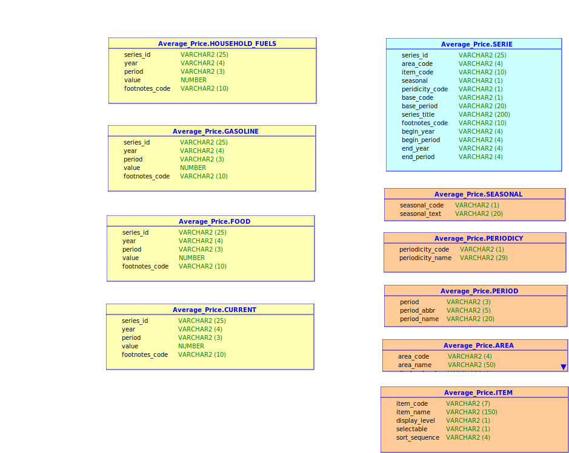

## Average Prices

### Origin of data:
[Bureau of Labor Statistics](https://www.bls.gov/cpi/tables/home.htm) 
https://www.bls.gov/cpi/tables/home.htm  

The bureau of labor statistics offers historical data of large sets:  
[LABSTATS](https://download.bls.gov/pub/time.series/) 
https://download.bls.gov/pub/time.series/ 

### Files
Files of average prices are under ap directory:  

* ap.data.0.Current		- All current year-to-date data
*	ap.data.1.HouseholdFuels	- All household fuels data
*	ap.data.2.Gasoline		- All gasoline data
*	ap.data.3.Food			- All food data
* ap.area				- Area codes		mapping file
* ap.contacts			- Contacts for ap survey  
* ap.footnote			- Footnote codes	mapping file
* ap.item				- Item codes		mapping file
* ap.period			- Period codes		mapping file
* ap.series			- All series and their beginning and end Dates
* ap.txt				- General information

### Relationships of files

External dimensions:  
 * SEASONAL
 * ITEM
 * AREA
 * PERIOD
 * PERIODICITY  
 
Main dimension:  
 * SERIE

Facts:  
 * rest of tables.

### Number of Rows

| Files | Number of Rows | Fact Table | Dimension Table |
|-------|----------------|------------|-----------------|
| ap.data.0.Current | 960933 | Yes | No | 
| ap.data.1.HouseholdFuels | 59800 | Yes  | No |
| ap.data.2.Gasoline | 257630 | Yes | No |
| ap.data.3.Food | 16487 | Yes | No |
| ap.area	 | 60094 | No | Yes |
| ap.item | 11258 | No | Yes |
| ap.period	 | 45180 | No | Yes |
| ap.series| 200967 | No | Yes |
