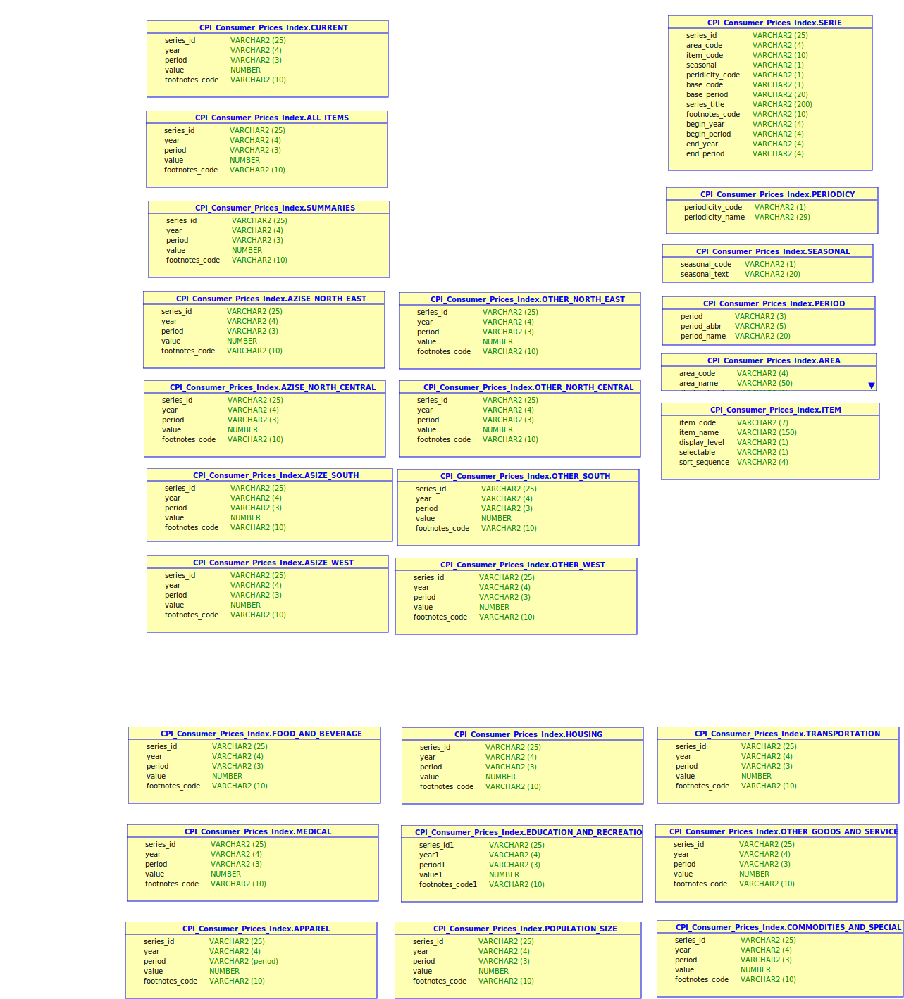

## CPI Consumer Price Index.

### Origin of data

The data is obtained from: 
[Bureau of Labor Statistics](https://www.bls.gov/cpi/tables/home.htm)

The bureau of labor statistics offers historical data of large sets: 
[LABSTATS](https://download.bls.gov/pub/time.series/)

### Files

On owerview file,  
[Overview](https://download.bls.gov/pub/time.series/overview.txt), let's us select series. 

* CU - Consumer Price Index-All Urban Consumers (Current Series)
* MU - Consumer Price Index-All Urban Consumers (Old Series) It will be no treated. 

Available files.
* cu.data.0.Current			       -  All current year-to-date 
* cu.data.1.AllItems		       -  All items (item_code AA0, SA0)
* cu.data.2.Summaries		       -  Summaries (item_code SA0, SAF,SAH, SAA, SAT, SAM, SAR, SAE, SAG,SAS, SAC)
* cu.data.3.AsizeNorthEast		 -  A-Size areas in Northeast (area_code A1 ...)
* cu.data.4.AsizeNorthCentral	 -  A-size areas in North Central (area_code A2 ...)
* cu.data.5.AsizeSouth			   -  A-Size areas in South (area_code A3 ...)
* cu.data.6.AsizeWest			     -  A-Size areas in West (area_code A4 ...)
* cu.data.7.OtherNorthEast		 -  All other Northeast(area_code 01, X1, D1)
* cu.data.8.OtherNorthCentral	 -  All other North Central(area_code 02, X2, D2)
* cu.data.9.OtherSouth			   -  All other in South (area_code 03, X3, D3)
* cu.data.10.OtherWest			   -  All other in West (area_code 04, X4)  
* cu.data.11.USFoodBeverage		 -  All US Food and Beverage (area_code 0000, item_code SAF, SEF)
* cu.data.12.USHousing			   -  All US Housing (area_code 0000, item_code SAH, SEH)
* cu.data.13.USApparel			   -  All US Apparel (area_code 0000,item_code SAA, SEA)
* cu.data.14.USTransportation	 -  All US Transportation (area_code 0000, item_code SAT, SET)
* cu.data.15.USMedical			   -  All US Medical (area_code 0000, item_code SAM, SEM, SS57)
* cu.data.16.USRecreation			 -  All US Recreation (area_code 0000,item_code SAR, SER, SS31, SS61, SS62)
* cu.data.17.USEducationAndCommunication	-  All US Education and Communication (area_code 0000, item_code SAE,SEE, SS27)
* cu.data.18.USOtherGoodsAndServices	-  All US Other Goods and Services (area_code 0000, item_code SAG, SEG; SS33)
* cu.data.19.PopulationSize		-  All Population-size (area_code A000, X000, D000)
* cu.data.20.USCommoditiesServicesSpecial	-  All US Commodity and Services and Special(area_code 0000, item_code SA0, SAC, SAN, SAS)
* cu.area					            -  Area codes		mapping file
* cu.contacts				          -  Contacts for cu survey 
* cu.footnote				          -  Footnote codes	mapping file
* cu.item					            -  Item codes		mapping file
* cu.MapErrors (TBR)			    -  Map error codes	mapping file
* cu.period				            -  Period codes 	mapping file
* cu.series				            -  All series and their beginning and end dates
* cu.txt					            -  General information

### Relations beetween files.

Although It is well defined and explained in cu.txt file. The following diagram shows us a visual representation:  

External dimensions:  
* ITEM
* AREA
* PERIOD
* PERIODICITY

Main dimension:  
* SERIE

Facts:  
* rest of tables.

### Serie Id Code 

CUUR0400AA0. It can be broken into 
* CU - Survey Code. 
* U  - Season Code (Unajusted)
* R  - Periodicity (R = Montly)
* 0400 - Area Code
* AA0  - Item Code

### Number of Rows

| Files | Number of Rows | Fact Table | Dimension Table |
|-------|----------------|------------|-----------------|
| cu.data.0.Current | 960933 | Yes | No | 
| cu.data.1.AllItems | 59800 | No  | Yes |
| cu.data.2.Summaries | 257630 | Yes | No |
| cu.data.3.AsizeNothEast | 16487 | Yes | No |
| cu.data.4.AsizeNorthCentral | 60094 | Yes | No |
| cu.data.5.AsizeSouth | 11258 | Yes | No |
| cu.data.6.AsizeWest | 45180 | Yes | No |
| cu.data.7.OtherNorthEast| 200967 | Yes | No |
| cu.data.8.OtherNorthCentral | 231518 | Yes | No |
| cu.data.9.OtherSouth | 269760 | Yes | No |
| cu.data.10.OtherWest | 249966 | Yes | No |
| cu.data.11.USFoodBeverage | 142089 | Yes | No |
| cu.data.12.USHousing | 57234 | Yes | No | 
| cu.data.13.USApparel | 30512 | Yes | No | 
| cu.data.14.USTransportation | 48071 | Yes | No |
| cu.data.15.USMedical | 21453 | Yes | No |
| cu.data.16.USRecreation | 29636 | Yes | No |
| cu.data.17.USEducationAndComunication | 18266 | Yes | No |
| cu.data.18.USOtherGoodsAndServices | 15998 | Yes | No |
| cu.data.19.PopulationSize | 35413 | Yes | No |
| cu.data.20.USCommoditiesServicesSpecial | 79329 | Yes | No |
| cu.item | 401 | No | Yes |
| cu.series | 8096 | No | Yes |
| cu.period | 16 | No | Yes |
| cu.periodicity | 2 | No | Yes |
| cu.seasonal | 2 | No | Yes |

  
