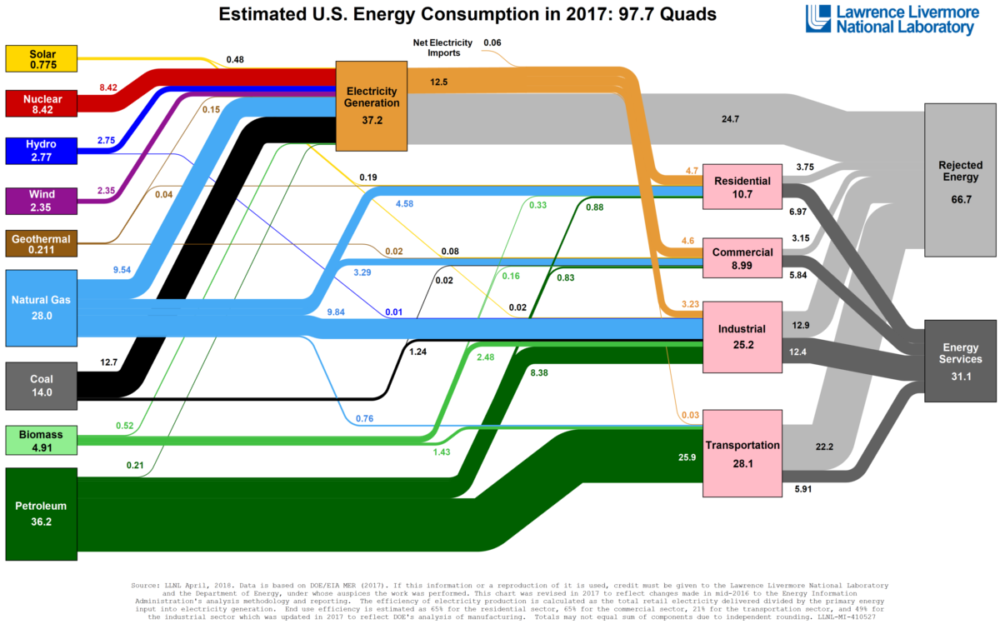

## Energy

All Information about energy is located at https://www.eia.com

### Energy Production

To follow all path of energy production we are going to use this infographics  

Credits of graphic  
*LLNL April, 2018. Data is based on DOE/EIA MER (2017). If this information or reproduction is used, credit must be given to the Lawrence Livermore National Laboratory and the department of Energy. under whose auspices the work was performed. This chart was revised in 2017 to reflec changes made in mid-2016 to the Energy Information Administration's analysis methodology and reporting*

#### Solar thermal and photovoltaic electricity total net generation 
Series SOTGP.  
https://api.eia.gov/series/?api_key=YOUR_KEY&series_id=SEDS.SOTGP.XX.A  
Where XX is state code. A stands for annual  

#### Nuclear electricity total net generation
Series NUETP.  
https://api.eia.gov/series/?api_key=YOUR_KEY&series_id=SEDS.NUETP.XX.A  
Where XX is state code. A stands for annual  
	
#### Hydroelectricity net generation in the electric power sector  
Series HYEGP.  
https://api.eia.gov/series/?api_key=YOUR_KEY&series_id=SEDS.HYEGP.XX.A  
Where XX is state code. A stands for annual  

#### Wind electricity total net generation
Series WYTCP.  
https://api.eia.gov/series/?api_key=YOUR_KEY&series_id=SEDS.WYTCP.XX.A  
Where XX is state code. A stands for annual  

#### Geothermal electricity net generation in the electric power sector
Series GEEGP.  
https://api.eia.gov/series/?api_key=YOUR_KEY&series_id=SEDS.GEEGP.XX.A  
Where XX is state code. A stands for annual  

#### Natural Gas Production
The url's for obtaining the files are: 
Natural Gas Gross Withdrawals and Production. Units Montly-Million Cubic Feet.  
https://www.eia.gov/dnav/ng/ng_prod_sum_a_EPG0_FGW_mmcf_m.htm  
Natural Marketed Production. Units Montly-Million Cubic Feet.  
https://www.eia.gov/dnav/ng/ng_prod_sum_a_EPG0_VGM_mmcf_m.htm  

#### Coal
Series CLPRB. Coal Production. Units Billion Btu
https://api.eia.gov/series/?api_key=YOUR_KEY&series_id=SEDS.CLPRB.XX.A  
Series CLPRP. Coal Production. Thousand of short Tons.
https://api.eia.gov/series/?api_key=YOUR_KEY&series_id=SEDS.CLPRP.XX.A  
Where XX is state code. A stands for annual  

#### Biomass total consumption
Series BMTCB.  
https://api.eia.gov/series/?api_key=YOUR_KEY&series_id=SEDS.BMTCB.XX.A  
Where XX is state code. A stands for annual  

#### Petroleum
Series PATCB. All petroleum products total consumption. Billion Btu.
https://api.eia.gov/series/?api_key=YOUR_KEY&series_id=SEDS.PATCB.XX.A  
Series PATCP. All petroleum products total production. Thousand of barrels
https://api.eia.gov/series/?api_key=YOUR_KEY&series_id=SEDS.PATCP.XX.A  

#### Electricity Generation
Electricity generation is calculated adding all primary energy sources: solar, nuclear, hidro, wind, geothermal, natural gas,coal.
The url for obtaining the file is: 
https://api.eia.gov/series/?api_key=YOUR_KEY&series_id=ELEC.GEN.ALL-XX-99.M 
Where XX is the state code and M the periodicity.   

### Energy Retail Prices

### Origin of data
The origin of data comes from EIA (Energy Information Administration) 
[EIA](https://www.eia.gov) 
https://www.eia.gov<vr>
  
Datasets:
  * [Electricity Sales to Ultime Consumers](https://www.eia.gov/opendata/browser/electricity/retail-sales)
  
### Files

* Electricity  
We must use an API.
  * URL: https://api.eia.gov/v2/electricity/retail-sales/data/
  * Method: GET
  * Description: Electricity sales to ultimate customer by state and sector (number of customers, average price, revenue, and megawatthours of sales). 
    Sources: Forms EIA-826, EIA-861, EIA-861M
  
* Natural Gas Prices
  We must use an API.
  * URL: https//www.eia.gov/opendata/browser/natural-gas/pri/sum)
  * Method: GET

* 
